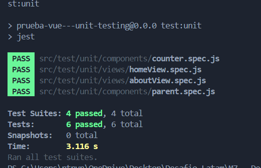

# Prueba Vue + Unit Testing

This project is deployed on Vercel. You can view it [here](https://vue-unit-testing.web.app/).

### Install dependencies

npm install

### Run tests

npm run test:unit 

## Successful tests

The tests were successfully executed. Here is the result:

